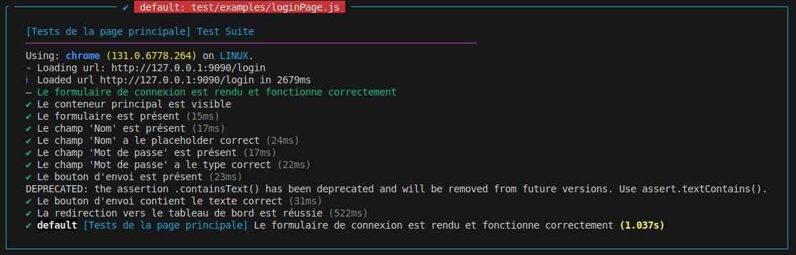

# Framework E2E

## Description du test

### Test de la page d'admin

## **Scénario 1 : Vérification du rendu du tableau des messages**

### Étapes :
1. **Connexion réussie** :
   - Entrer le nom d'utilisateur dans le champ correspondant.
   - Entrer le mot de passe dans le champ correspondant.
   - Cliquer sur le bouton "submit".

2. **Affichage du tableau** :
   - Une fois connecté, la page contenant le tableau des messages doit s'afficher.

3. **Vérifications dans le tableau** :
   - **L’en-tête du tableau** doit contenir les colonnes suivantes :
     - *Dates*
     - *Auteurs*
     - *Arrivée -> Départ*
     - *Messages*
     - *Supprimer*
   - **Les données du tableau** doivent être correctement affichées, incluant :
     - Une date dans chaque ligne.
     - Un auteur dans chaque ligne.
     - Des informations sur *Arrivée -> Départ* dans chaque ligne.
     - Un message dans chaque ligne.
     - Un bouton de suppression dans chaque ligne.

---

## **Scénario 2 : Vérification du bouton de déconnexion**

### Étapes :
1. Identifier le bouton de déconnexion situé dans la barre de navigation.

2. Cliquer sur le bouton.

### Résultat attendu :
- L’utilisateur est redirigé vers la page de connexion (**l'URL contient `/login`**) après avoir cliqué sur le bouton.


### Results :


---

## Test de la page de contact

## **Scénario 1 : Vérification de l’header de la page**

### Étapes :
1. Maximiser la fenêtre.
2. Vérifier que l’élément `header` est présent.
3. Confirmer que le titre principal dans l’en-tête est : **"CONTACTEZ-NOUS"**.
4. Confirmer que le sous-titre dans l’en-tête est : **"complétez le formulaire"**.

### Résultat attendu :
- L’en-tête se charge correctement avec le titre principal et le sous-titre appropriés.

---

## **Scénario 2 : Vérification du formulaire de contact**

### Étapes :
1. Vérifier que le formulaire est présent.
2. Confirmer la présence et les attributs des champs suivants :
   - **`firstName`** : Champ présent avec un placeholder défini comme "Jean".
   - **`lastName`** : Champ présent.
   - **`mobilePhone`** : Champ présent avec un motif de validation `pattern` pour les numéros au format **0[6|7]{1}([0-9]{2}){4}**.
   - **`email`** : Champ présent.
   - **`arrivedAt`** : Champ présent.
   - **`departureAt`** : Champ présent.
   - **`message`** : Zone de texte présente.
   - **Bouton de soumission** : Bouton présent avec le type défini comme `submit`.

### Résultat attendu :
- Le formulaire de contact se charge correctement avec tous les champs nécessaires et leurs attributs respectifs.

### Results :


---

## Test de la page de feedback

## **Scénario 1 : Vérification de la visibilité du formulaire de feedback**

### Étapes :
1. Naviguer vers la page `http://127.0.0.1:9090/feedback`.
2. Attendre que l’élément principal `main.container` soit visible (max 5 secondes).
3. Vérifier la visibilité des éléments suivants :
   - Le formulaire de feedback (`form`).
   - Le champ pour le nom (`input[name="name"]`).
   - Le champ pour le message (`textarea[name="message"]`).
   - Le bouton de soumission (`button[type="submit"]`).

### Résultat attendu :
- Tous les éléments du formulaire de feedback sont visibles sur la page.

---

## **Scénario 2 : Vérification de la soumission du formulaire de feedback**

### Étapes :
1. Naviguer vers la page `http://127.0.0.1:9090/feedback`.
2. Attendre que le formulaire de feedback soit visible (max 5 secondes).
3. Entrer les données suivantes :
   - **Nom** : "John Doe".
   - **Message** : "This is a test message."
4. Faire défiler jusqu’au bouton de soumission pour le rendre visible.
5. Cliquer sur le bouton de soumission (`button[type="submit"]`).
6. Vérifier les points suivants après la soumission :
   - L’URL reste sur `/feedback`.
   - Les champs de saisie (nom et message) se réinitialisent à des valeurs vides.

### Résultat attendu :
- Le formulaire est envoyé avec succès, les champs se réinitialisent, et l’utilisateur reste sur la page de feedback.

### Results :


---

## Test de la page principale

## **Scénario 1 : Vérification de l’header**

### Étapes :
1. Accéder à la page `http://127.0.0.1:9090/geo`.
2. Maximiser la fenêtre du navigateur.
3. Vérifier les éléments suivants dans l’en-tête :
   - Le texte principal est **"IDÉALEMENT LOCALISÉ"**.
   - Le sous-titre est **"30 mètres de la plage"**.
   - Le bouton sombre avec le texte **"CONTACTEZ-NOUS"** est visible et contient un lien vers **/contact**.

### Résultat attendu :
- Tous les éléments mentionnés sont correctement affichés.

---

## **Scénario 2 : Vérification de la section 'Accès'**

### Étapes :
1. Vérifier que le titre **"Accès"** est présent.
2. Faire défiler jusqu’à l’élément contenant les informations d’accès.
3. Vérifier les détails suivants :
   - Le temps de trajet est indiqué comme **"8 heures"**.
   - Le trajet mentionne **"Autoroute jusqu'à Figueras."**.
   - La première option de trajet est **"Paris → Roses"**.
   - La distance affichée est **"900 km."**.

### Résultat attendu :
- L’information d’accès est correctement affichée.

### Results :


---

## **Scénario 3 : Vérification de la section 'Localisation'**

### Étapes :
1. Vérifier que la section **"Carte"** contient un titre correct.
2. Confirmer que la section inclut un iframe de Google Maps.

### Résultat attendu :
- La carte est affichée avec un iframe de Google Maps valide.

---

## **Scénario 4 : Vérification de la section 'Localisation'**

### Étapes :
1. Vérifier que le titre **"Localisation"** est affiché dans la section correspondante.
2. Vérifier que l’iframe de la carte de Google Maps inclut l’attribut **src** avec l’URL correcte.

### Résultat attendu :
- La section **"Localisation"** montre correctement le titre et l’iframe avec l’URL.

---

## **Scénario 5 : Vérification de la section 'À proximité'**

### Étapes :
1. Faire défiler jusqu’à la section **"À proximité"**.
2. Vérifier que le titre est **"À proximité"**.
3. Confirmer que le contenu descriptif indique **"Situé sur la promenade longeant la mer"**.

### Résultat attendu :
- Le contenu de la section est correctement affiché.

---

## **Scénario 6 : Vérification de la liste 'Nos meilleures adresses'**

### Étapes :
1. Vérifier que le titre de la liste est **"Nos meilleures adresses"**.
2. Confirmer que la liste inclut les restaurants suivants :
   - **Restaurant Rosa**.
   - **Jamoneria Jamon 100 %**.
   - **Sidreria Toxt's**.

### Résultat attendu :
- La liste est affichée avec tous les restaurants mentionnés.

### Results :


---

## Scénario : Vérification du login Page

### Étapes :
1. Accéder à la page `http://127.0.0.1:9090/login`.
2. Vérifier la présence et la structure du formulaire de connexion :
   - Le formulaire est visible.
   - Le champ **'Nom'** est présent avec un attribut placeholder de valeur **"hello world"**.
   - Le champ **'Mot de passe'** est présent avec un type **"password"**.
   - Le bouton de soumission est visible et contient le texte **"Envoyer"**.

3. Tester l’interaction avec le formulaire :
   - Entrer le texte **"user"** dans le champ **'Nom'**.
   - Entrer le texte **"user"** dans le champ **'Mot de passe'**.
   - Cliquer sur le bouton **'Envoyer'**.
   - Vérifier que l’URL contient **"/admin"**, ce qui confirme la redirection vers le tableau de bord.

### Résultat attendu :
- La structure du formulaire est correcte.
- Les interactions fonctionnent correctement et conduisent à une redirection vers le panneau d'administration.

### Results :



---

## Test de la page Tarifs

## **Scénario : Vérification du contenu initial et des cartes de prix**

### Étapes :
1. Accéder à la page `http://127.0.0.1:9090/pricing`.
   - **Résultat attendu** : La page de prix se charge correctement.

2. **Test : Vérification de l’en-tête** :
   - Maximiser la fenêtre.
   - Vérifier la présence du conteneur d’en-tête.
   - **Résultat attendu** : Le conteneur d’en-tête est présent.
   - Vérifier le contenu du titre principal.
   - **Résultat attendu** : Le titre principal affiche "UN PRIX POUR" et "TOUTES LES SAISONS".
   - Vérifier le sous-titre et le texte du prix.
   - **Résultat attendu** : Le sous-titre contient "Viens séjourner à Rosas", et le texte du prix est "De 460 € à 760 € / semaine".
   - Vérifier la présence du bouton de contact.
   - **Résultat attendu** : Le bouton de contact est visible avec le texte "CONTACTEZ-NOUS".

3. **Test : Carte basse saison** :
   - Naviguer jusqu’à la section "Basse saison".
   - **Résultat attendu** : La carte montre "Basse saison" avec un prix de 460 € / semaine.
   - Vérifier la présence d’un bouton de contact.
   - **Résultat attendu** : Le bouton de contact est visible sur la carte de basse saison.

4. **Test : Carte moyenne saison** :
   - Naviguer jusqu’à la section "Moyenne saison".
   - **Résultat attendu** : La carte montre "Moyenne saison" avec un prix de 560 € / semaine.
   - Vérifier la présence d’un bouton de contact.
   - **Résultat attendu** : Le bouton de contact est visible sur la carte de moyenne saison.

5. **Test : Carte haute saison** :
   - Naviguer jusqu’à la section "Haute saison".
   - **Résultat attendu** : La carte montre "Haute saison" avec un prix de 760 € / semaine.
   - Cliquer sur le bouton de contact et vérifier que la redirection fonctionne correctement.
   - **Résultat attendu** : La page de contact est accessible avec le titre "CONTACTEZ-NOUS".

### Results :


---

## Installation

Utilisez le gestionnaire de paquets [npm](https://www.npmjs.com/) pour installer les dépendances nécessaires.

Tout d'abord, installez Node v16 avec :
```bash
nvm install 16
```

Installer les dépendances

```bash
npm install
```

Lancer l’API

```bash
npm run api-start
```

Lancer le serveur de développement

```bash
npm run start
```

Exécuter les tests

```bash
npm test
```